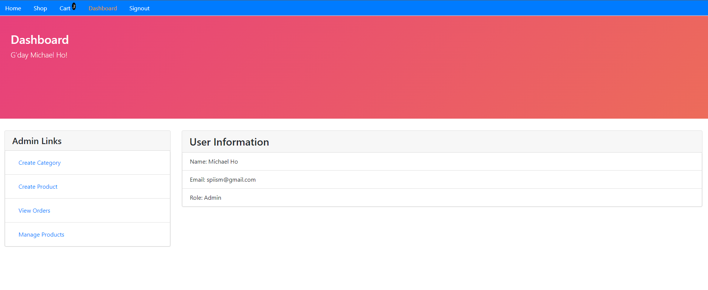

# e-book store

A full-stack online book store using React for the front-end, Express-Node.js for the back-end, MongoDB for the database, and the ability to handle payments through PayPal and Credit Card Payment. It also includes an Admin Dashboard System.

You can access the website by opening [https://www.ebook.twistingleaf.com/](https://www.ebook.twistingleaf.com/) in your web browser.

Please note that this is a working version of the e-book store designed for learning purposes. Development of this project has been halted due to outdated packages that require time-consuming updates. A more advanced version of the project has been developed, but this version is provided here for reference.

